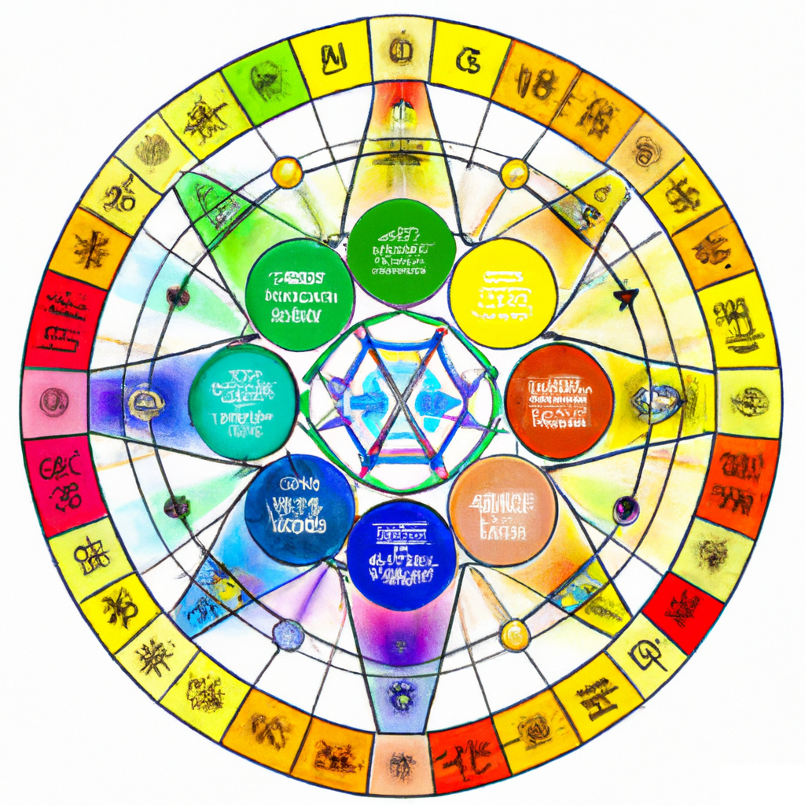

# wheel-of-emotions
Content for Mu Labs and Modern Mantra collaborative interactive earth/human voxel cube projection map project



---

Emotions are mapped inside of the `WheelOfEmotionsContent` Directory...

Each directory contained within maps to the following emotions...

```
0-29    - Alert
30-59   - Elated
60-89   - Happy
90-119  - Contented
120-149 - Relaxed
150-179 - Calm
180-209 - Fatigued
210-239 - Depressed
240-269 - Sad
270-299 - Upset
300-329 - Stressed
330-359 - Tense
```
